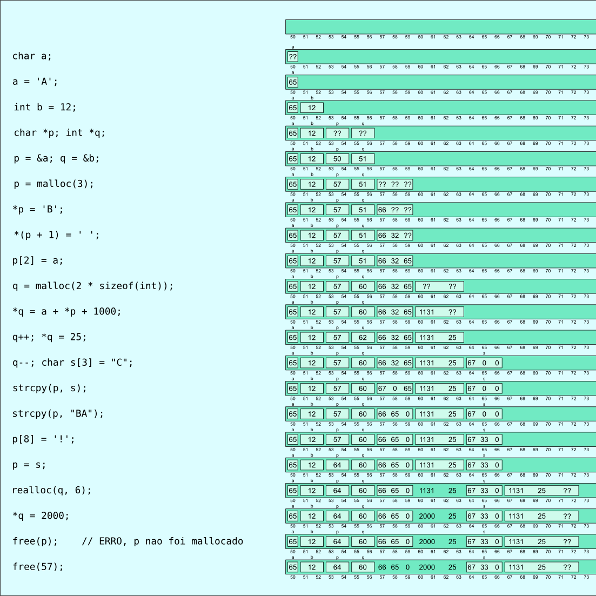

## Alocação dinâmica de memória

A forma principal de abstração para a memória da linguagem C são as variáveis.
A criação de uma variável é uma forma organizada de se dizer ao compilador que se quer um tanto de memória, que esse tanto vai ser usado para armazenar dados de um determinado tipo, que vai passar a ser referenciado por tal nome dentro do programa.
O compilador vai então verificar que todo o uso dessa memória é realizado de acordo com esse "contrato", e vai tentar otimizar a quantidade de memória necessária para esse uso (por exemplo, quando uma função começa sua execução, suas variáveis precisam de memória, mas quando uma função termina de executar, essas variáveis não são mais necessárias, e a memória que elas estão utilizando pode ser reutilizada para outra coisa -- isso é feito automaticamente pelo compilador).

Mas essa forma de usar memória por vezes tem limitações, e em algumas situações surge a necessidade de se ter um controle maior sobre o uso da memória.
Por exemplo, para poder usar memória além da pré-definida pelas variáveis presentes no programa (pense em um programa que só vai poder definir quanto de memória vai precisar depois que já está executando, porque lê dados de um arquivo, por exemplo), ou para organizar o uso da memória de uma forma diferente da imposta pela alocação e liberação ligada automaticamente à ordem de execução das funções (uma função que cria uma variável e gostaria que ela pudesse ser usada pela função que a chamou, por exemplo).

Para esses casos, tem-se a alocação explícita de memória (mais conhecida como alocação dinâmica, que é um nome pior, porque a alocação automática feita pelo mecanismo de execução das funções também é dinâmica).
Nessa forma de alocação de memória, é o programador quem realiza a alocação e a liberação da memória, no momento que considerar mais adequado.
Essa memória é por vezes chamada de anônima, porque não é vinculada a uma variável com nome pré-definido.

Como essa memória não é associada a variáveis, a forma que se tem para usar esse tipo de memória é através de ponteiros.

Existem duas operações principais de manipulação desse tipo de memória: a operação de alocação e a operação de liberação de memória.
Quando se aloca memória, se diz quanto de memória se quer (quantos bytes), e se recebe do sistema esse tanto de memória, na forma de um ponteiro para a primeira posição do bloco de memória alocado. As demais posições seguem essa primeira, de forma contígua, como em um vetor.
Para se liberar a memória, passa-se um ponteiro para essa mesma posição, o sistema sabe quanto de memória foi alocada e faz o necessário para disponibilizar essa memória para outros usos.
Depois de liberado, o bloco de memória não pode mais ser utilizado.

Essas operações estão disponibilizadas em C na forma de funções, acessíveis incluindo-se `stdlib.h`.
Essas funções são `malloc` e `free`.
A função `malloc` recebe um único argumento, que é a quantidade de bytes que se deseja, e retorna um ponteiro para a região alocada, que tem esse número de bytes disponíveis. Caso a alocação não seja possível, o ponteiro retornado tem um valor especial, chamado `NULL`. Sempre deve-se testar o valor retornado por `malloc` para verificar se a alocação de memória foi bem sucedida.

A função `free` recebe um único argumento, que é um ponteiro para a primeira posição de memória do bloco a ser liberado, obrigatoriamente o mesmo valor retornado por um pedido de alocação de memória anterior.

Não existe limitação no tamanho de um bloco a alocar, nem na quantidade de blocos alocados, a não ser a quantidade de memória disponível no sistema.

Para facilitar o cálculo da quantidade de memória, existe o operador `sizeof`, que dá o número de bytes usado por qualquer tipo de dados. Por exemplo, `sizeof(double)` diz quantos bytes de memória são necessário para se armazenar um valor do tipo `double`.

Por exemplo, para alocar memória para um double e colocar o valor 2.54 nessa memória, podemos fazer:
```c
   double *p;
   p = malloc(sizeof(double));
   if (p == NULL) {
     aborta_com_erro("memória insuficiente!");
   }
   *p = 2.54;
```

Para se alocar memória para uma estrutura ponto:
```c
   typedef struct {
     float x;
     float y;
   } ponto;
   
   ponto *p = malloc(sizeof(ponto));
   if (p == NULL) {...}
   p->x = 10;
   p->y = -2.5;
   // ... 
   free(p);   // a memória não é mais necessária - libera para ser reutilizada.
```

Um pouco mais útil é alocar memória para vários dados do mesmo tipo. Por exemplo, para alocar memória para colocar um milhão de inteiros:
```c
   int *p;
   p = malloc(1000000*sizeof(int));
   // ...
```
Agora temos uma região de memória onde cabem um milhão de inteiros, e temos um ponteiro apontando para o primeiro deles.
Como acessar os demais?
A memória alocada é contígua, os demais inteiros estão em posições subsequentes da memória, após aquele que é apontado diretamente pelo ponteiro. Em C, se temos um ponteiro apontando para um dado de um determinado tipo que está em certa posição de memória, podemos ter um ponteiro para a posição do dado seguinte somando 1 ao ponteiro:
```c
   int v[10];
   int *p;
   p = &v[4];      // p aponta para v[4]
   int *q;
   q = p + 1;      // q aponta para v[5]
   q -= 4;         // agora q aponta para v[1]
   *q = 5;         // armazena 5 em v[1]
   *(p - 3) = 10;  // armazena 10 em v[1]
   int x = p - q;  // x vale 3
```
Essas operações são chamadas de **aritmética de ponteiros**. Tem 3 operações definidas: soma ou subtração de um inteiro a um ponteiro (resulta em um ponteiro para um dado que está tantas posições distante do dado apontado pelo ponteiro) e subtração de ponteiros (resulta em um inteiro que representa o número de dados desse tipo que podem ser colocados na região de memória entre os ponteiros). Os ponteiros participantes dessas operações devem referir-se a uma mesma região de memória.

Com o uso de aritmética de ponteiros, podemos acessar os vários valores de uma região alocada por malloc:
```c
   int *p;
   p = malloc(1000000 * sizeof(int));
   if (p == NULL) {...}
   for (int i = 0; i < 1000000; i++) {
     *(p + i) = rand();
   }
```
Cuidado com os parênteses! O que faz `*(p + i) = *p + i`?

Essa forma de acesso a dados através de ponteiros é tão comum que se criou uma notação especial, para não ser necessário usar os parênteses. `*(p + i)` pode ser escrito como `p[i]`.
Em outras palavras, pode-se usar uma região de memória alocada para vários dados do mesmo tipo como se fosse um vetor.
(O contrário também é verdade, se `v` é um vetor, pode-se usar a notação `*(v + 2)` para se acessar seu segundo elemento, mas quase ninguém usa isso).

O código acima poderia ser:
```c
   int *p;
   p = malloc(1000000*sizeof(int));
   if (p == NULL) {...}
   for (int i = 0; i < 1000000; i++) {
     p[i] = rand();
   }
```


Como a memória alocada é contígua, uma forma usual de se usar a memória alocada é como um vetor. Como vimos anteriormente, o uso de um vetor através de um ponteiro é muito semelhante (pra não dizer igual) ao uso de um vetor diretamente. O fato de o ponteiro estar apontando para memória alocada explicitamente ou estar apontando para memória que pertence a um vetor de verdade não muda a forma de uso.

Por exemplo, para se alocar memória para se usar como um vetor de tamanho definido pelos dados, pode-se usar algo como:

```c
#include <stdio.h>
#include <stdlib.h>

float calcula(int n, float v[n])
{
  // faz um cálculo complicado sobre os elementos do vetor
  float t = 0;
  for (int i = 0; i < n; i++) {
    t += v[i];
  }
  return t / n;
}

int main()
{
  float *vet;
  int n;
  printf("Quantos dados? ");
  scanf("%d" , &n);

  vet = malloc(n * sizeof(float));
  if (vet == NULL) {
    desiste("Memória insuficiente");
  }

  // a partir daqui, vet pode ser usado como se fosse um vetor de tamanho n
  for (int i = 0; i < n; i++) {
    printf("digite o dado %d ", i);
    scanf("%f", &vet[i]);
  }
  float resultado = calcula(n, vet);
  printf("O resultado do cálculo é: %f\n", resultado);
  free(vet);
  // a partir daqui, a região apontada por vet não pode mais ser usada.
  return 0;
}
```

### Exercício

1. Faça uma função que recebe o nome de um arquivo contendo valores `float` e retorna um vetor dinamicamente alocado preenchido com os números contidos no arquivo. A função deve também retornar o tamanho do vetor. Faça um programa para testar essa função, que calcula e imprime a média desses valores (usando a função `calcula` do exemplo acima).


### Realocação de memória

As vezes, após se alocar memória e usá-la para colocar dados, as necessidades do programa (em termos da quantidade de memória para esses dados) mudam.
Para esses casos, existe uma função que permite alterar a quantidade de memória de uma região previamente alocada.
A função se chama `realloc`, e recebe como parâmetros um ponteiro para uma região previamente alocada e o novo tamanho que se quer para essa região.
A função não tem como garantir que existe memória disponível logo após a região afetada, ou mesmo que exista pode achar mais conveniente usar uma outra região. Nesse caso, ela aloca memória em outro lugar, copia o conteúdo da região original para a nova região e libera a região original para ser reutilizada.
Por causa disso, `realloc` retorna um ponteiro para a nova região (que pode ser igual à antiga).
Além disso, pode ser que a alocação não seja possível, e nesse caso a região antiga não é afetada, e `realloc` retorna NULL.
Então, quando se usa realloc, é necessário gerenciar esses 2 ponteiros. Uma forma de se fazer isso:
```c
   ponto *p = malloc(n * sizeof(ponto));
   /// usa a área apontada por p
   /// ops, a área está muito pequena!
   ponto *np = realloc(p, nn * sizeof(ponto));
   if (np == NULL) {
     // OPS, não deu para aumentar, dá para desistir ou continuar com o que tem em p
   } else {
     // a realocação foi possível, o valor de p pode ser inválido, o que vale é np
     // para continuar usando essa área como p, faz p apontar para a nova área
     p = np;
     // np não é mais necessário
   }
```

Uma função alternativa de alocação, por vezes preferível em relação à malloc porque inicializa a memória alocada com zeros e deixa mais explícita a intenção de se alocar um vetor é calloc. Em vez de `p = malloc(n * sizeof(xis))`, pode-se usar `p = calloc(n, sizeof(xis))`.

O desenho abaixo pode ajudar... (A última linha é bobagem, de onde tiraria o 57? Na prática a memória em 57 seria perdida.)


